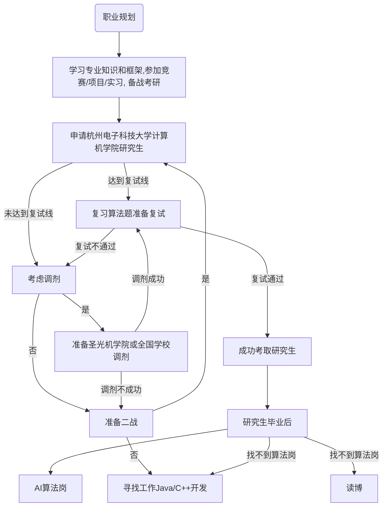

[TOC]

>  本次规划**不重复**去年内容，对其进行更新和补充，以**考研分析**作为规划重点，并使用统计学理论加以分析。
>
>  本文的数据分析使用Python完成，源文件在[Naasi-LF/hzu (github.com)](https://github.com/Naasi-LF/hzu)

## 一、自我评估与定位

### 1. 自我评估

**(1) 提升点**（与大一的自己相比较）

① 熟练掌握数据结构：有效应对各类题型，特别是考研相关试题。

② 算法能力显著提升：深入理解动态规划和搜索问题的解决方案。

③ 掌握机器学习和统计学知识：能够建立模型，解决实际问题。

④ 掌握爬虫技术：能够有效获取网络数据。

⑤ 学会开发前后端分离的Web应用：增强了网络开发能力。

⑥ 掌握QT基础：能够开发小型UI界面。

⑦ 学会使用LaTeX编写论文：提升了学术写作能力。

⑧ 掌握专业的prompt调教技术：优化大型语言模型的使用。

⑨ 学习部分Java语法：扩展了编程语言知识。

⑩ 以Python为主要数据分析工具，同时了解Matlab的使用。

**(2) 存在的缺点**

① 不会使用Java进行开发：需要进一步学习Java开发技能。

② 英语能力不足：需要加强英语学习。

③ 缺乏数据库项目开发经验：需要增加数据库相关的实践。

④ 计算机网络知识不足：导致部分网络方面的部署困难。

⑤ 未学习Vue、Springboot、React等主流框架：需掌握这些现代前端和后端技术。

### 2. 自我定位

## 二、环境分析

### 1. 行业分析

如今随着人工智能的崛起，使得各个行业受到牵连，加上经济的不景气，很多IT行业出现了大量裁员现象。在前后端领域里，人们可以说是卷的不行！Java后端岗位出现饱和现象，加上程序员本身的35危机使得计算机行业从最强专业跌入神坛。但无论如何，计算机行业永远是工课领域的佼佼者。

**(1) AI的三大方向**

加上如今大模型和特化模型的发展，由此诞生了三种方向：

**① 大型科技公司的角色**

大型科技公司如谷歌、微软、百度和OpenAI等，在AI大模型的发展上扮演着关键角色。这些公司通过投资数千万甚至数十亿美元购买GPU、标注数据来训练像ChatGPT、文心一言等基座大模型。

**②  开源模型的二次开发**

在中国和美国，许多企业和研究机构选择在开源的基座大模型如ChatGLM3、Llama2、阿里通义等基础上进行二次开发。这类玩家专注于训练专属于自己企业领域的大模型，应用领域涵盖电商、量化交易、教育、工业知识库、天气预测、客服机器人等。

**③ 基于大模型的应用开发**

第三种类型的玩家则专注于在基座大模型或领域大模型的基础上开发各类应用程序。这种类型的开发难度相对较低，但对于推动AI技术的普及和应用具有重要意义。也就是被人所调侃的**“面向GPT编程”**成为主流编程。

本人估计，若国家不对AI进行限制，第三类方向将在不久后成为主流程序员的必备技能，即使用专业提示词对模型进行问答式的编程。此时更加注重程序员的整体观念而非编程语言的语法本身。

**(2) AI算法岗的行业类型：**

**①  自然语言处理**

两个方向：**信息流和智能对话**

信息流例如针对UC的评论的情感分析、舆论分析来挖掘用户的信息。

智能对话的典型代表便是以ChatGPT为首的大语言模型，需要构建一系列特化的针对本企业的语言模型，例如AI客服等等。

**②  计算机视觉**

图像分类、图像识别等技术。例如小区的自动识别车牌号等等。

**③  推荐算法**

各大平台的推荐算法，例如抖音中根据你的视频阅读时长和搜索记录来判断你的爱好喜好，来推荐符合你爱好的视频。

这类的岗位招聘时，会优先考虑如下方面：

精通C++/Java/Python

良好的数学和统计学基础

熟悉tensorflow、Pytorch 、Scikit-Learn等机器学习算法库。

### 2. 院校分析（重点）

**(1) 院校筛选**

院校需满足所需的**两个条件**：考试范围为数学一+英语一+408计算机学科专业基础（11408） 并且尽量**江浙沪**一带。

根据自己的实际水平，筛选出如下的满足条件的院校：
$$
\begin{array}{ccc}
\hline 学校 & 级别 & 具体 \\
\hline 南京航空航天大学 & 211 & 今年刚刚改考408，对此不做分析 \\
中国矿业大学（徐州） & 211 & 22408，暂时不优先考虑 \\
南京林业大学 & 双一流 & 22408，暂时不优先考虑 \\
南京理工大学 & 211 & 黑榜考研院校，不考虑 \\
上海大学 & 211 & 可以考虑 \\
上海财经大学 & 211 & 可以考虑 \\
上海师范大学 & 双非 & 可以考虑 \\
杭州电子科技大学 & 双非 & 可以考虑 \\
浙江工业大学 & 双非 & 可以考虑 \\
\hline
\end{array}
$$
因此初步将目标院校定为：上海大学、上海财经大学、上海师范大学、杭州电子科技大学、浙江工业大学。

若选择读博，考虑头衔和名声，优先选择**上海大学**和**上海财经大学**。

若选择研后就业，则要考虑院校的计算机实力，优先选择**杭州电子科技大学**，理由如下：
$$
\begin{array}{cccc}
\hline 序号 & 高校名称 & 高校层次 & 评估等级 \\
\hline 1 & 清华大学 & 985 & A+ \\
 2 & 国防科技大学 & 985 & A+ \\
 3 & 北京大学 & 985 & A+ \\
 4 & 北京航空航天大学 & 985 & A+ \\
 5 & 浙江大学 & 985 & A+ \\
 6 & 南京大学 & 985 & A+ \\
...&...&...&...\\
 25 & 中山大学 & 985 & A- \\
 26 & 吉林大学 & 985 & A- \\
 27 & 中南大学 & 985 & A- \\
 28 & 湖南大学 & 985 & A- \\
 29 & 四川大学 & 985 & A- \\
 30 & 杭州电子科技大学 & 双非 & A- \\
\hline
\end{array}
$$
在第五轮计算机学科评估中，杭电的得到了A-的成绩，这也是唯一一所双非上榜的院校。

结合学校本身，会有诸多大厂前来校招，在浙江的地位也只在浙大之下，有杭电的学历时在浙江本地求职都比较吃香。即使在江苏一带，四电两邮的计算机学科也同样被大多数企业所认可。

目前的我对读博的意向不高，因此综合考虑：我会选择**杭州电子科技大学**的研究生。

**(2) 院校验证**

 先需要验证**考研杭电的可行性**。从以下几个方面入手：

**① 录取名额**

杭电的选考专业经过初步分析，定为如下：
$$
\begin{array}{cccc}
\hline 院校 & 专业 & 类型 & 人数 \\
\hline 计算机学院 & 081200(计算机科学) & 专硕 & 80 \\
\hline & 083500(软件工程) & 专硕 & 20 \\
& 085404(计算机技术) & 学硕 & 190 \\
 & 085405(软件工程) & 学硕 & 60 \\
\hline 杭电圣光机 & 085404(计算机技术) & 专硕 & 30 \\
\hline
\end{array}
$$
计算机学院的计科和软工专业本质没有太大区别，都可以报考，关键在于导师的研究方向。因更偏向就业，学硕专硕都可以选择。

杭电圣光机学院可以作为考不上计算机学院的后手。它的合作院校为圣光机大学，是俄罗斯最强的计算机院校。不用出国，2.5年后获得双学位证书，并且学费不高，一年3万多甚至低于一些专硕。

从录取名额来看，计算机学院的录取人数很多，符合报考的条件。

**② 复录比**

考研的复录比（进复试人数/录取人数）往往决定了一个学校是否可以大胆报考，一般复录比在1.2~1.5之内是较少，超过1.5算较多

杭电的计算机学院复录比约为1.2，较为公平。

杭电的圣光机学院复录比约为1.1，较为公平。（考虑到其中外合作的特殊性，几乎是去面试了就进了）

据此，杭电不存在复试大把大把刷人的情况。

 **③ 一志愿录取占比**

一志愿录取/总录取人数往往反应学校是否保护第一志愿，收多少调剂生。

杭电的计算机学院一志愿录取占比为100%，本院一直**不收任何调剂生**。

杭电的圣光机学院一志愿录取占比为45%，收55%调剂生，但是29名上线的一志愿学生全部拟录取。因此圣光机每年会有一半空缺出来，计算机学院未考取可以选择调剂圣光机学院。

计算机学院**绝对性的保护一志愿学生**，也是选择它的重要因素。

**④ 实录取人数占比**

一般实际的录取人数与计划录取人数会有不同，占比决定了学校是扩招处理还是缩招处理。
$$
\begin{array}{ccccc}
\hline 计算机学院 & 081200 & 083500 & 085404 & 085405 \\
\hline 计划人数 & 80 & 20 & 190 & 60 \\
 实际人数 & 90 & 20 & 193 & 61 \\
\hline
\end{array}
$$
计算机学院学硕计科扩招10人，其中基本一致。

圣光机学院计划30人，实际40人，扩招10人。

因此本校**有扩招趋势，适合报考**。

**(3) 成绩分析**

我将计算机学院的软工专硕的拟录取名单作为分析对象。

**① 得分分布**

分析综合成绩，复试，初试的一个分布情况，得到下面的分布


1. **综合成绩**：这个指标的分布看起来相对集中，表明大多数考生的综合成绩比较接近，可能意味着综合评分标准比较均衡或考生整体表现接近。
2. **初试成绩总分**：因为是将复试线截断所以不符合正态分布，与综合成绩相比，可能有更明显的波动。这可能表明初试成绩在考生之间的差异较大，或者初试的难度和评分标准可能导致了成绩的波动。
3. **复试成绩**：复试成绩的分布可能相对更分散一些，这表明考生在复试环节的表现差异可能更大。这种差异可能源于复试的内容、难度或考生在面试和其他评估方面的表现差异。

因分值的分布情况并非理想的正太分布，数据分布是偏态的，中位数通常是更好的选择。中位数对异常值不敏感，能更好地代表数据集的“典型”值。初步的样本分析如下：
$$
\begin{array}{ccc}
\hline
\text{名称} & \text{数值对} & \text{中位数} \\
\hline
\text{综合成绩} & (65.04, 78.52) & 69.072 \\
\text{初试成绩} & (290, 388) & 320.0 \\
\text{复试成绩} & (66.64, 88.6) & 78.43 \\
\hline
\end{array}
$$
**② 初试复试的相关性**

要确定初试成绩和复试成绩之间是否存在相关性，可以使用统计方法来评估它们之间的关系。常用的方法是计算两个变量之间的相关系数，最常用的是**皮尔逊相关系数**。

经过计算，初试成绩总分和复试成绩之间的皮尔逊相关系数约为 **0.071**。这个值接近于 0，表明两者之间的相关性非常弱。这意味着根据这些数据，初试成绩与复试成绩之间几乎没有显著的线性关系。

**因此初试高的同学，复试未必就高。**初试通常包括笔试，重点可能在于考生的学术知识和理论掌握程度，而复试可能包括面试、口试或实践能力测试，更多地评估考生的综合素质、思维能力和实际应用能力。这种评估内容的差异可能导致两者之间的相关性不高。

**③ 初试和复试的重要性**

用线性模型研究初试和复试有多大程度影响综合成绩，散点图和直线拟合图如下：


从图中可以看出，随着初试和复试成绩的提高，综合成绩也倾向于提高。这表明两者之间存在一定的正相关关系。这是必然，因为综合成绩便是由两者构成。

通过数据分析得到如下结论：

1. **初试成绩和综合成绩的相关性较强**：初试成绩模型的 R² 分数较高（约 0.665），表明初试成绩与综合成绩有较强的正相关关系。这意味着，通常情况下，**初试成绩好的同学其综合成绩也不会太差**。初试成绩在一定程度上可以作为预测综合成绩的一个有效指标。
2. **复试成绩对最终总成绩的影响**：虽然复试成绩模型的 R² 分数较低（约 0.403），但**斜率较初试的大**。这意味着，复试成绩对最终综合成绩也有显著影响，尤其是对于那些初试成绩相近的考生来说，**复试成绩可能成为区分他们最终综合成绩的关键因素**。

两者的好成绩缺一不可。初试成绩为综合成绩提供了一个基础预测，而复试成绩则可能在此基础上进一步调整最终的综合成绩。

这也初步判定，**初试和复试的占比是6比4**，并非网上传言的7比3（后查找复试相关通知也证实了是6比4，7比3是疫情线上复试的占比）

**④ 被刷人群分析**

分析被刷人群的相关信息，往往可以更好规划目标的考分。

以专硕软件工程为例，**录取60人，进复试74人**，展开如下分析：

只在录取名单中的姓名： {'黄祖健'} 

只在复试名单中的姓名： {'陈贇波', '姚婉佳', '戴才竣', '鲁锴', '罗永康', '周瑞', '李安俊', '鲍成毅', '黄思佳', '高文博', '丁士航', '陈曙光', '朱巍', '王磊', '徐敏'}

由此说明，有**一人保送**，在复试中被**刷下来的共有15人**，对着15人进行分析。

15人的初试成绩如下图所示，他们都小于300分，都属于一个较低的水平，因此复试被刷也在情理之中。换句话说，**杭电本专业的考研分数最低要在300分以上才不容易被刷下来。**
$$
\begin{array}{cc}
\hline 姓名 & 总分 \\
\hline 高文博 & 299 \\
鲁锴 & 299 \\
徐敏 & 299 \\
鲍成毅 & 296 \\
... & ... \\
黄思佳 & 292 \\
周瑞 & 292 \\
陈贇波 & 291 \\
罗永康 & 291 \\
\hline
\end{array}
$$
在录取中，也仅仅只有三位小于300的学生未被刷下来。

这也可以表面学校并**没有保护本校生**，而是更多以成绩说话。

**⑤ 算法分析**

已知综合成绩转换分数公式为：
$$
综合成绩 = 初试成绩/5*0.6+复试成绩*0.4
$$
以65.04的最低分为例，则初试成绩(290, 388)的学生复试最低分的竞争图如下：


已知复试的最低分为66分，**因此初试考在320分时最稳妥**，基本复试再差也不会有被拉下去的风险。

因被刷下来的几乎在290-300分段，说明300-310的学生复试都在70以上，然而290-300的学生未必面试就比300-310的学生差了这么多，所以我初步判定，**复试的高主观性导致成绩也会因初试的成绩而影响**。尝试使用神经网络进行拟合：


经过分析得知，**一般复试80分的初试很多在360以上，70分的很多在300~350分段。290-300分到进来的，基本复试都要考在80分左右**。这也是一个重要参考因素。

## 三、实施策略

### 1. 考研策略

结合院校分析，我将我的考研分数定在320以上最为稳妥，为了应对考试发挥超常和失常的情况，最坏的打算目前将理想分数定在350分。

**(1) 初试单科分析**

以杭电软件工程学生的数据为例，分析学生每门科目的正太分布情况，如下图：


从图中可以观察到：

“政治理论”科目的曲线峰值最高，且相对较窄，这意味着学生在这个科目上的分数比较集中且均值较高，很难拉开差距。

“外国语”科目的曲线峰值次之，曲线也相对较窄，表明这个科目的分数分布也比较集中，但分布范围略宽于政治理论。

“数学”和“专业课”的曲线峰值较低，且曲线更宽，尤其是计算机，表明学生在这两个科目上的分数分布更加分散，标准差更大，更容易拉开差距。

因此考研需要把重心放在专业课和数学上，一是分值大，二是拉开差距大。
$$
\begin{array}{ccccc}
\hline & 政治理论 & 外国语 & 数学 & 专业课 \\
\hline 均值 & 64.635135 & 59.108108 & 95.662162 & 96.391892 \\
最大值 & 76.000000 & 74.000000 & 132.000000 & 122.000000 \\
最小值 & 51.000000 & 39.000000 & 62.000000 & 63.000000 \\
\hline
\end{array}
$$

**(2) 初试目标确定**

根据我的单科的分析，我将对目标分数350各科成绩进行规划：

因为本人政治和英语的分数不会太高，数学和专业课的成绩变得尤为重要。

在优化过程中，目标函数和约束条件结合起来指导优化算法寻找满足所有约束且目标函数值最小的成绩分配。在政治和外语成绩相对较低的前提下，为了总分达到350分，四科成绩的调整后最优分配为： 
$$
\begin{array}{cc}
\hline 科目 & 调整后最优分配的成绩 \\
\hline 政治理论 & 65分 \\
外国语 & 65分 \\
业务课1 & 110分 \\
业务课2 & 110分 \\
\hline
\end{array}
$$
**① 政治策略**

不用太早开始，在大三下学期开始背书刷题，坚持即可。

**② 英语策略**

每日完成墨墨背单词并且打卡，在大三下学期坚持一周一套模拟卷即可。

**③ 数学一**

**从现在开**始坚持复习高数、线代、概率论知识，巩固理论。大二暑假开始全面刷题复习。

大二寒假复习概率论，能看多少看多少。

**④ 408**

现在学校课程已经完成**数据结构和计算机组成**的学习，这两门可以开始跟着王道抽空复习。（计组考研考纲与学校学习内容差别巨大，可能要重新学习）

**操作系统和计算机网络**可以等待学校开课后边学课程边刷考研，目前不必着急，精力有限。

**(3) 复试规划**

根据招生章程，复试的组成公式如下：

$复试成绩（百分制）=专业笔试成绩（百分制）×30％＋面试成绩（百分制）×60％+外语能力 测试成绩（百分制）×10％$

其中，外语能力测试包含在面试中，因此**面试占了7成，笔试占了三成**。

笔试部分为专业笔试内容为计算机程序设计综合能力测试，也就是所谓的算法题，面试考察考生的综合能力。

**① 笔试策略**

为应对笔试，有如下策略：

* 每日一道算法题，在力扣/洛谷/acwing上打卡。
* 以赛促学，通过算法竞赛来促进自己算法水平。
* 扎实数据结构基础，不断巩固复习

**② 面试策略**

面试需带的材料如下：

个人陈述表 ；个人简历 ；大学成绩单（盖公章） ；英语四、六级成绩单或其他证明英语水平证书 ；科研成果佐证材料以及学科竞赛获奖证书（如有，请提供） ；CCF/CSP 计算机软件能力认证成绩或 PAT 计算机程序设计能力测试成绩（如有，请提供）

根据所需的材料，有如下策略：

* 参加企业实习，积累实习经验。

* 六级积极刷分

  补：480可免修英语，争取刷到500以上

* 大学尽量不挂科，争取专业课的高分成绩

  补：因各个本科院校的差异性一般考研院校不会过于注重大学的成绩和绩点，但是不代表他们不会看成绩单，专业课成绩还是尽量要高一些

* 尽可能参加大创或论文发表，为自己增添几个科研点（没有拉倒）

* 积极参加竞赛和考级

  竞赛对于复试的影响并不大。竞赛更重要的是促学，而类似互联网+的包装性比赛并不能给自己很好的锻炼，若是没有拿到奖甚至是一种前功尽弃的结果，因此这种比赛有最好但没有也不必过于纠结。大部分竞赛的益处仅仅只在综测和保研中有所作用，相对于考研和工作来说可有可无。

  对于计算机学生来说的比赛很少，我总结了如下比赛：
  $$
  \begin{array}{cccc}
  \hline 竞赛 & 说明 & 当前情况和计划 & 目标 \\
  \hline ACM/ICPC & 含金量最高的竞赛，一劳永逸但是极难获奖 & 根据自身水平和学校限制，暂时不考虑 & 无 \\
  蓝桥杯(重点) & 双非二本院校最适合的竞赛 & 大一得三等奖，未来会继续比赛 & 省一/国二 \\
  双周赛 & 力扣/ACW/牛客等双周赛，奖本身对考研作用不大、但是是一个练习算法的好平台 & 缺少限时练习 & 积极参与 \\
  互联网+/大挑 & 是个积累项目经验的好手段，重在形式上的美观和PPT。 & 今年暑假参与，对拿奖无所谓 & 有无都可 \\
  全国大学生计算机程序设计竞赛 & 获奖率不低也可以作为积累开发项目的手段。 & 已报名组队 & 省三，有奖就行 \\
  全国大学生数模竞赛(重点) & 对机器学习、大数据方面有一个很好的锻炼。 & 亚太杯得二等奖、华数杯得三等奖。预报名高教研杯 & 校特/国三 \\
  \hline
  \end{array}
  $$

  其他比赛例如百度之星、计挑赛也可以比，但是没必要。竞赛只是锦上添花，有是最好但不要沉迷于此。

  相比竞赛，CSP和PTA在考研和工作方面的作用更多，尤其是对于杭电来说，以下官网杭电最新发布的通知：
  
  
  ```
  根据杭州电子科技大学计算机类硕士研究生招考实际情况，经研究决定，2023年起，CCF CSP计算机软件能力认证成绩或PAT计算机程序设计能力测试成绩（历次最佳成绩）及相应佐证将作为计算机类相关专业硕士研究生复试时的重要参考，具体由计算机学院负责解释。正式通知以《杭州电子科技大学2023年硕士研究生招生简章》和《杭州电子科技大学2023年硕士研究生招生复试方案》为准。望大家相互转告，积极备考！
  ```
  
  也就是说，杭电将两者作为重要的复试参考依据，若两者成绩优秀会对复试大有帮助！
  
  我的考证计划如下：
  $$
  \begin{array}{ccc}
  \hline 考级 & 时间 & 目标 \\
  \hline CCF/CSP 计算机软件能力认证成绩 & 今年年底 & 300分以上 \\
  PAT 计算机程序设计能力测试成绩 & 今年暑假或者明年，PTA乙级 & 尽量满分 \\
  \hline
  \end{array}
  $$

根据以上分析发现，面试的准备和笔试的准备很大程度是相关联的，准备笔试的同时也会促进面试的准备。

### 2. 研后策略

本人基于对人工智能和大数据专业的极高的热爱，以后希望在这方向发展。本方向**不会招双非二本学生**，因此必须以考研作为跳板，但考研不是考公，考上了并非一劳永逸，研后的从事岗位，城市地区，都是重要的规划要点。

**(1) 从事岗位**

在研究生后，我希望从事的行业是AI算法岗位。具体方向希望是**自然语言处理（NLP）或者深广推**。

**(2) 城市**

如果考研选择杭电，就业城市选择**杭州**。如果是江苏上海的学校，就业城市优先选择**苏州**。

考虑到生存问题，上海暂时不会作为工作城市。、

**(3) 面试计划**

研究生期间，尽量完善自我的简历，使得研后面试能够顺利。
$$
\begin{array}{c}
\hline 简历中可以补充的项目经验（此表为读研期间） \\
\hline Kaggle竞赛项目 \\
阿里天池算法竞赛项目 \\
发表SCI期刊 \\
实验室/实习中的项目 \\
\hline
\end{array}
$$
**(4) 细节**

若要在AI算法岗位深造，万万不可成为掉包侠，而是要理解深层构架，推成出新。

研后的就业规划只是暂时的规划，前提是研究生必须考上。

## 四、评估调整

考虑到两点因素：1.研究生的考取不是必然 2.算法的少岗位性 

我制定了如下解决策略：本策略便是我完整的职业生涯规划图：



## 结语

在这份职业规划中，我明确了学习和职业的方向，深入分析了自身的优势与不足，并制定了具体的行动策略。这不仅是对未来的规划，更是对个人成长和发展的承诺。我清楚，要实现这些目标，必须付出持续不断的努力，同时保持对变化的适应能力。

“不到长城非好汉，屈指行程二万。”我将以此为动力，不断学习进步。
